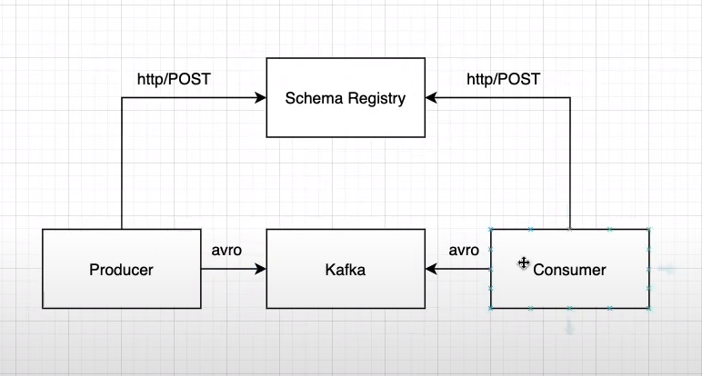

# 👀 Exemplo de produtor e consumidor com kafka

## 🎮️ Sobre
Este projeto busca de uma forma resumida mostrar como é feito a puplicação de um tópico e o consumo desta mesma mensagem utilizando o kafka.

## 👨‍💻️ Tecnogias utilizadas
O projeto foi desenvolvido utilizando as seguintes tecnologias:

💻️Spring Boot
💻Kafka
💻Docker
💻Avro

## :books: Materiais de referêmcia e estudo:
:movie_camera: Vídeo aula:  https://www.youtube.com/watch?v=DbkcOpWcMhU&list=PL2-2pWkcawAyl6VBbljlIVapbyxjGEpWA  
:inbox_tray: Repositório do projeto: https://github.com/felipesilvamelo28/kafka-schema-registry-example  

:blue_book: Spring Kafka: https://docs.spring.io/spring-kafka/reference/html/  
:blue_book: Kafka Docs: https://kafka.apache.org/documentation/  
:blue_book: Apache Avro: https://avro.apache.org/  
:blue_book: Schema Registry: https://docs.confluent.io/platform/current/schema-registry/index.html  

